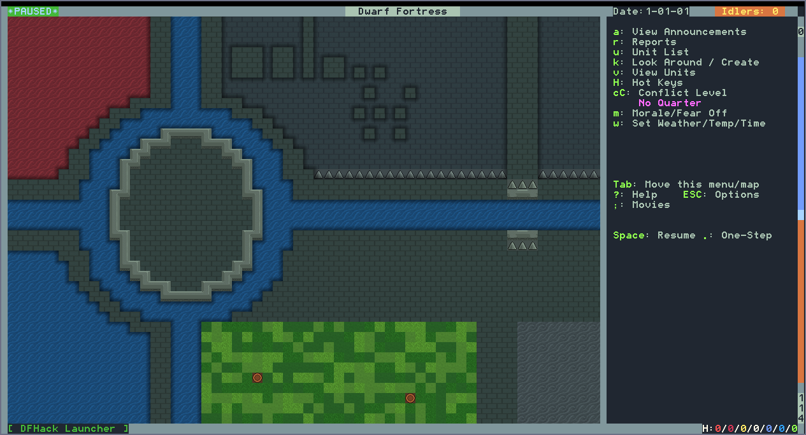

# juicy-fortress

opinionated dwarf fortress installer

## usage

grab the [latest release](https://github.com/backwardspy/juicy-fortress/releases/latest)

simply launch `juicy-fortress` to run the installer.

### options

use `-installDir DIR` to modify the installation location.
the default location is `dwarffortress`.

use `-verbose` to get more information about what's going on.

## contents

juicy-fortress installs & configures the following resources:

- [dwarf fortress](http://www.bay12games.com/dwarves/)
- [dfhack](https://docs.dfhack.org/en/stable/)
- [twbt](https://github.com/thurin/df-twbt)
    - multilevel rendering is enabled by default
- [spacefox](https://github.com/DFgraphics/Spacefox)

after a successful installation, your dwarf fortress should look like this:

errors in the dfhack console usually mean something went wrong.
please [create an issue](https://github.com/backwardspy/juicy-fortress/issues/new/choose)
if you suspect a problem with juicy-fortress!

